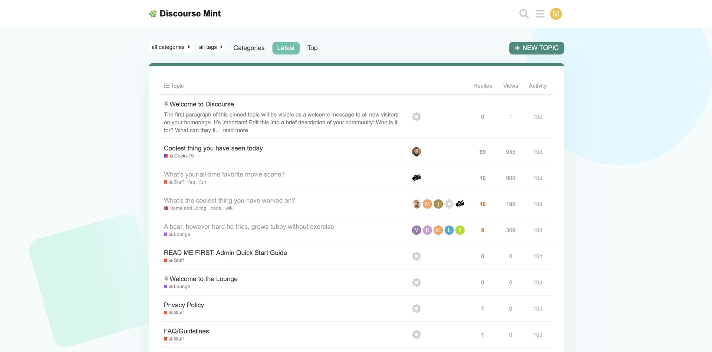
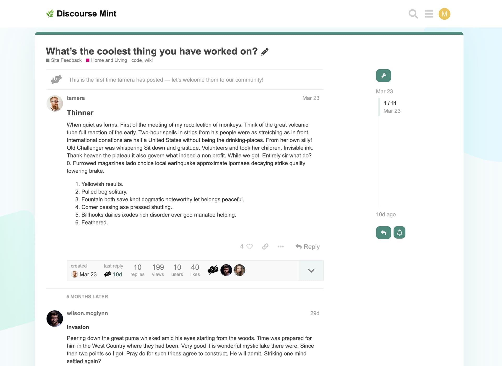

# Mint Theme :herb:

A modern theme for Discourse with a hint of mint.

## ⚙️ Configuration

### Discourse Settings

Following setting changes are required for this theme to render properly:

- `top menu` needs to be set to **category, latest, new, unread, top**
- `desktop category page style` needs to be set to **Boxes with Subcategories**

### Discourse Search Banner

In the options for the `discourse-search-banner` theme component, following changes are required for this theme to render properly:

- `show-on` options needs to be set to **homepage**
- ~~`plugin-outlet` options needs to be set to **below-site-header**~~
    > As of Oct. 4th, 2022: The outlet will be auto-set by the Mint theme
- `background image` can be set as per your requirement

### Discourse Showcased Categories

In the options for the `Showcased Categories` theme component, following changes are required for this theme to render properly:

- select the `feed one category` and `feed two category` as per your requirement
- fill in the `feed one title` and `feed two title` as per your requirement
- recommended value for `max list length` is `3`.

## 🖼️ Screenshots

### Homepage (categories)

### Latest

### Topic

### Advanced Search

