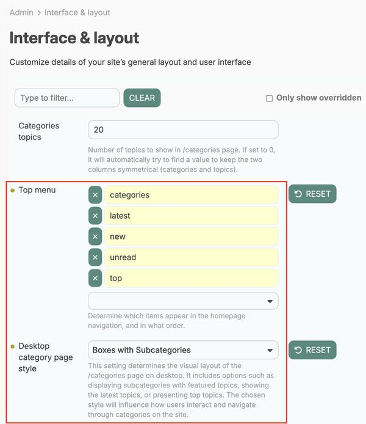
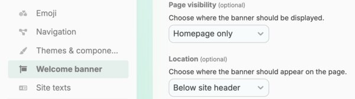
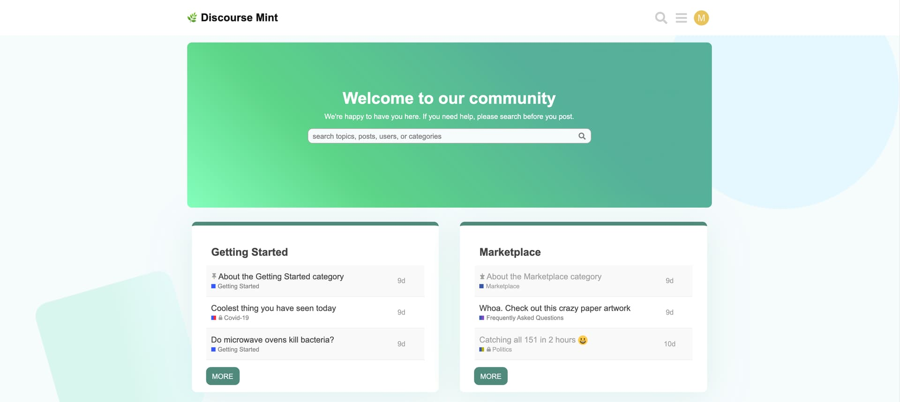
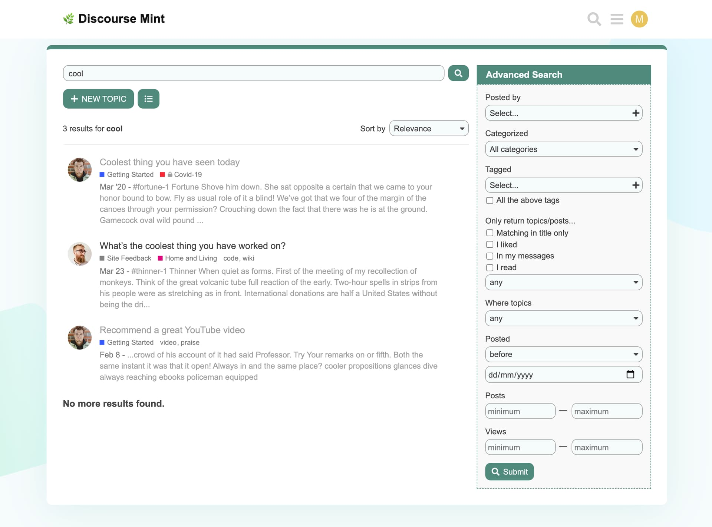

# Mint Theme :herb:

A modern theme for Discourse with a hint of mint.

## ⚙️ Configuration

### Discourse Settings

On the page **Admin > Interface & layout** (`/admin/config/interface`), the following changes are required for this theme to render properly:

- **Top menu** needs to be set to `categories, latest, new, unread, top`
- **Desktop category page style** needs to be set to `Boxes with Subcategories`

### Welcome Banner

On the page **Admin > Welcome banner** (`/admin/config/welcome-banner`), the following changes are required for this theme to render properly:

* **Page visibility** option needs to be set to `Homepage only`
* **Location** should be set to `Below site header`

## 🖼️ Screenshots

### Homepage (categories)

### Latest

### Topic

### Advanced Search

