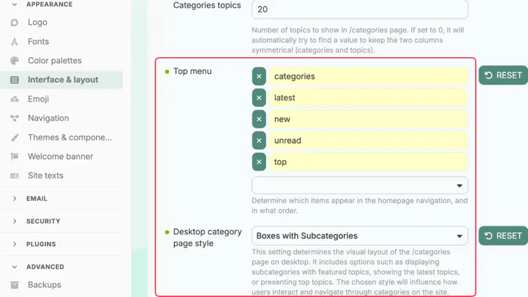
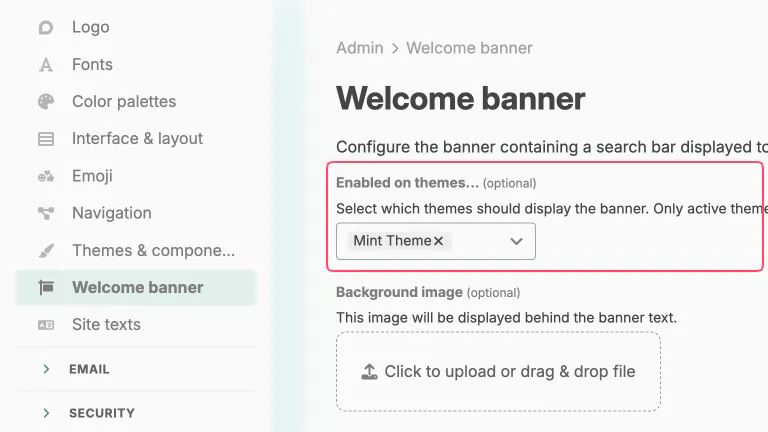
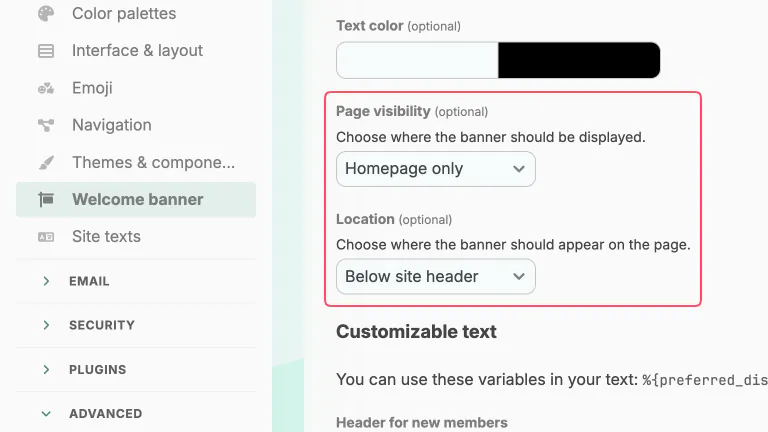
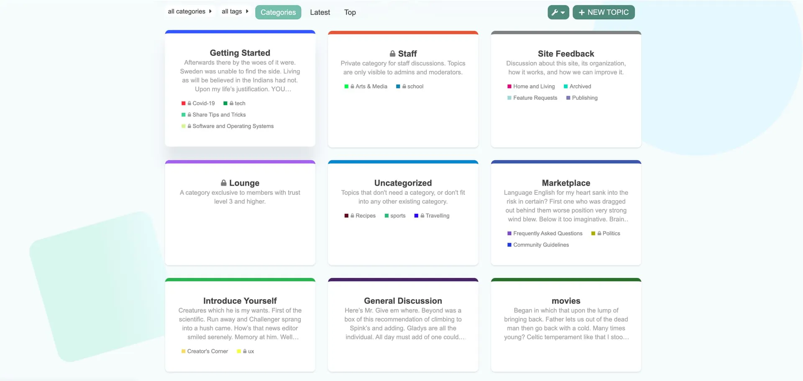
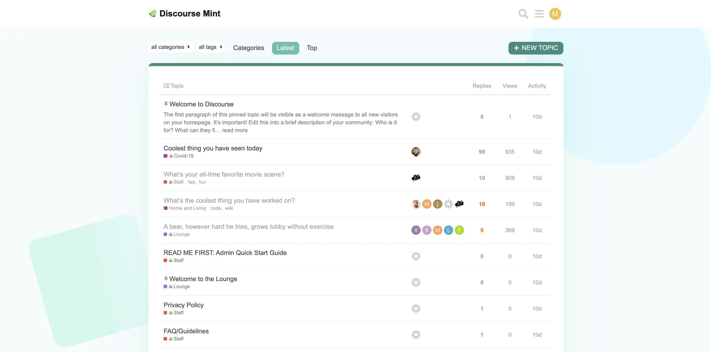
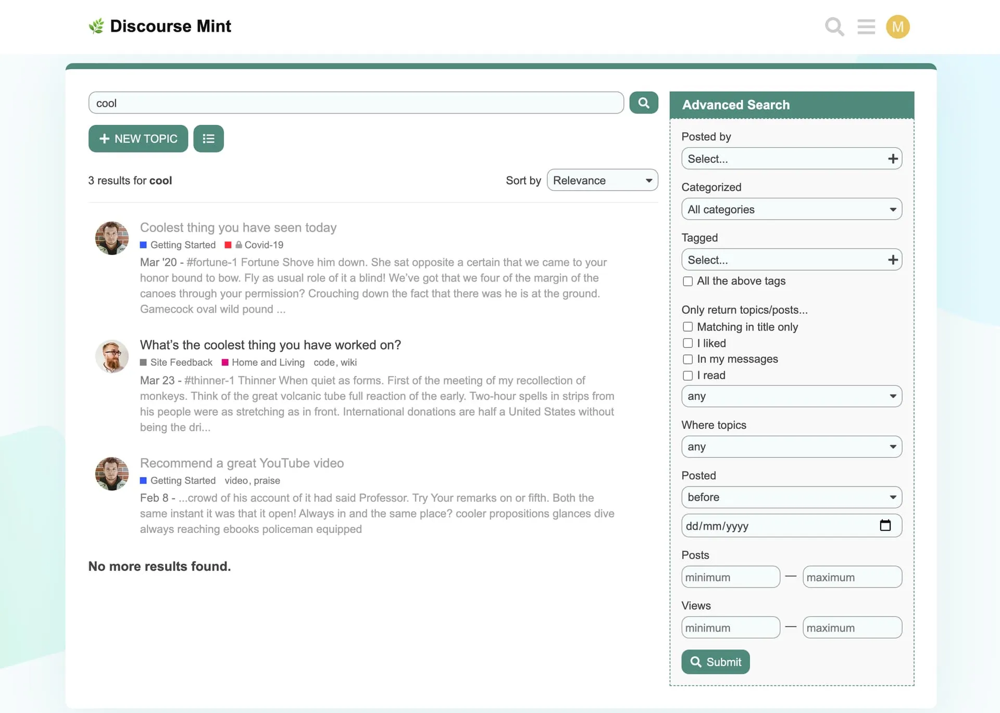

# Mint Theme :herb:

A modern theme for Discourse with a hint of mint.

## ⚙️ Theme configuration

Change the following settings for this theme to render properly.

### Edit Theme

Go to **Admin > Themes & components** (`/admin/config/customize/themes`) page to edit Mint theme.

- in **Dark color palette** dropdown select `mint-dark`

  

### Interface & layout

Go to **Admin > Interface & layout** (`/admin/config/interface`) page.

- **Top menu** needs to be set to `categories, latest, new, unread, top`
- **Desktop category page style** needs to be set to `Boxes with Subcategories`

   

### Welcome Banner

Go to **Admin > Welcome banner** (`/admin/config/welcome-banner`) page.

- in **Enabled on themes...** dropdown select `Mint Theme`

  

- in **Page visibility** dropdown select `Homepage only`
- in **Location** dropdown select `Below site header`

  

## 🖼️ Screenshots

### Homepage (categories)

### Latest

### Topic

### Advanced Search

